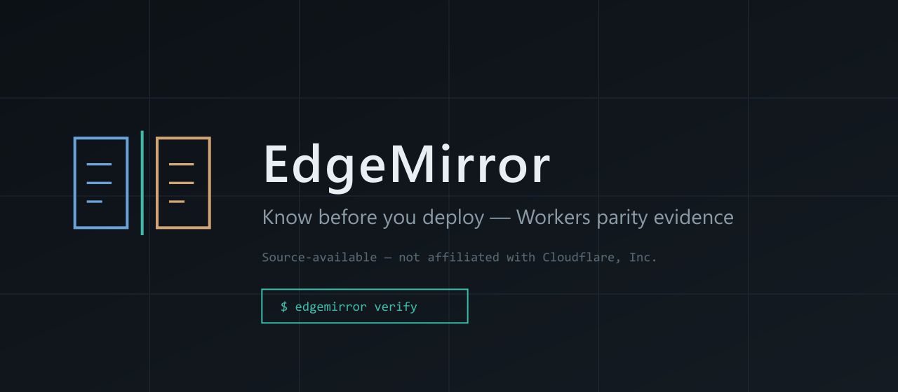

# EdgeMirror

<p align="center">
  
</p>

<p align="center"><strong>Know before you deploy.</strong></p>

<p align="center">
  The evidence layer Cloudflare Workers deploys need — differential proof that local <code>workerd</code> ≈ the real platform, before <code>wrangler deploy</code>.
</p>

<p align="center">
  <a href="https://theworker02.github.io/EdgeMirror/"><strong>Live Cloudflare demo</strong></a>
  ·
  <a href="./ACQUISITION.md"><strong>Acquisition brief</strong></a>
  ·
  <a href="./COMMERCIAL.md"><strong>Commercial license</strong></a>
</p>

```bash
npx edgemirror verify
# Gold-standard gate before deploy:
npx edgemirror init --cloudflare-gate
npx edgemirror deploy
```

EdgeMirror is an independent **source-available** project (not open source) and is **not affiliated with, endorsed by, or sponsored by Cloudflare, Inc.** Evaluation use is permitted under [`LICENSE`](./LICENSE); production and commercial use require a paid license — see [`COMMERCIAL.md`](./COMMERCIAL.md).

-0e1419?style=flat-square)


-3dbaa8?style=flat-square&labelColor=0e1419)

<p align="center">
  
</p>

---

## Table of contents

1. [What EdgeMirror is](#what-edgemirror-is)
2. [Why it exists (platform quality)](#why-it-exists-platform-quality)
3. [Quickstart](#quickstart)
4. [How it works](#how-it-works)
5. [Cloudflare support (all STABLE)](#cloudflare-support-all-stable)
6. [CI gate — verify before deploy](#ci-gate--verify-before-deploy)
7. [Deploy path & support-bundle](#deploy-path--support-bundle)
8. [Supercharger (shipped, optional)](#supercharger-shipped-optional)
9. [Benchmarks (measured)](#benchmarks-measured)
10. [Evidence model](#evidence-model)
11. [Commands](#commands-validated-cli)
12. [Status (honest)](#status-honest)
13. [Installation](#installation)
14. [Security](#security)
15. [Commercial license & acquisition](#commercial-license--acquisition)
16. [Honesty rules](#honesty-rules)
17. [Documentation index](#documentation-index)
18. [License](#license)

---

## What EdgeMirror is

EdgeMirror is a **CLI-first parity engine** for Cloudflare Workers. It runs the **same parity corpus** against:

1. **Local** — `wrangler dev --local` (workerd)
2. **Remote / preview** — real Cloudflare Workers or preview URLs when credentials exist

It then **normalizes** nondeterminism, **diffs** traces, **classifies** differences, and writes **evidence receipts** (`EM-###`) you can share in a PR or attach to a Cloudflare support ticket.

When Cloudflare credentials are missing, EdgeMirror reports `REMOTE_NOT_CONFIGURED`. It **never invents parity**.

| Layer | What you get |
|-------|----------------|
| Verify gate | Fail CI / deploy on divergence or insufficient evidence |
| Deploy path | `edgemirror deploy` = verify → `wrangler deploy` |
| Escalation | `edgemirror support-bundle` packages receipts + doctor + compat |
| Bindings | Full **STABLE** HTTP/WS-observable matrix |
| Supercharger | Optional DAG scheduler + CU budgets (not required for verify) |

---

## Why it exists (platform quality)

Cloudflare’s Workers story depends on **trust that local ≈ production**. Wrangler and workerd are excellent — and still not identical to the production platform. Teams still ship Workers changes **blind** to local/prod drift unless they have differential evidence in the default path.

EdgeMirror owns that evidence loop:

1. **Default CI / deploy gate** — `edgemirror verify` fails on divergence or insufficient evidence; scaffold with `init --cloudflare-gate` and require the check before merge/deploy.
2. **Wrangler-adjacent deploy path** — `edgemirror deploy` runs verify, then shells out to `wrangler deploy`. Failed verify aborts unless `--force` (loud warning).
3. **Support escalation** — `edgemirror support-bundle` exports `EM-###` receipts + doctor support-report + compat artifacts for Cloudflare tickets.

Acquisition / partnership brief: [ACQUISITION.md](./ACQUISITION.md) · engineering one-pager: [pitch/cloudflare/ENGINEERING_BRIEF.md](./pitch/cloudflare/ENGINEERING_BRIEF.md)

---

## Quickstart

**Requirements:** Node.js ≥ 20, a Cloudflare Worker project (Wrangler config).

```bash
# From this monorepo
npm install
npm run build

cd fixtures/basic-worker
npx edgemirror init
npx edgemirror doctor
npx edgemirror verify --local
npx edgemirror demo          # isolated DEMO divergence — never mixes with real corpus
```

Gold-standard Cloudflare gate + deploy:

```bash
npx edgemirror init --cloudflare-gate
npx edgemirror verify
npx edgemirror deploy         # verify then wrangler deploy
npx edgemirror support-bundle # ticket packet
```

With `CLOUDFLARE_API_TOKEN` + `CLOUDFLARE_ACCOUNT_ID`:

```bash
npx edgemirror verify
npx edgemirror preview
npx edgemirror pitch-demo     # controlled local↔preview divergence for diligence demos
```

Agent-friendly output: `edgemirror verify --format agent`

---

## How it works

```text
discover project
  → prepare local target
  → prepare remote/preview (or REMOTE_NOT_CONFIGURED)
  → execute the same ParityTest on both
  → capture ExecutionTrace → redact → normalize
  → diff → classify
  → evidence receipt + report
  → cleanup EdgeMirror-owned remote resources
```

<p align="center">
  
</p>

Deep dive: [docs/ARCHITECTURE.md](./docs/ARCHITECTURE.md)

### Visual examples (DEMO-labeled)

The following SVGs are **illustrative / DEMO** stand-ins — not live production metrics or recorded terminals:

| Asset | Notes |
|-------|--------|
| [docs/assets/terminal-demo.svg](./docs/assets/terminal-demo.svg) | SVG stand-in (not a real gif/webm recording) |
| [docs/assets/finding-example.svg](./docs/assets/finding-example.svg) | **DEMO** finding presentation |
| [docs/assets/compatibility-matrix.svg](./docs/assets/compatibility-matrix.svg) | **DEMO** matrix illustration |
| [docs/assets/github-check.svg](./docs/assets/github-check.svg) | Illustrative CI mock |
| [docs/assets/supercharger.svg](./docs/assets/supercharger.svg) | Illustrative gauge — real engine is CLI `supercharge` |

Dashboard UI fixtures (when present) are likewise **DEMO-labeled**. Brand guidelines: [branding/BRAND.md](./branding/BRAND.md) · status vocabulary: [branding/STATUS.md](./branding/STATUS.md) · badges: [docs/assets/badges.md](./docs/assets/badges.md).

---

## Cloudflare support (all STABLE)

Claims come from the machine-readable support report (`edgemirror doctor --support-report` / `.agent/cloudflare-support-report.json`).

| Area | Parity (EdgeMirror) |
|------|---------------------|
| HTTP fetch handler | **STABLE** |
| Plaintext vars | **STABLE** |
| KV / D1 / R2 / Durable Objects / service bindings | **STABLE** |
| Queues / Workflows / Hyperdrive / Vectorize / Workers AI / WebSockets / Crons | **STABLE** |

Full matrix: [docs/CLOUDFLARE_INTEGRATION.md](./docs/CLOUDFLARE_INTEGRATION.md) · [docs/site/cloudflare/support-matrix.md](./docs/site/cloudflare/support-matrix.md) · fixture: [`fixtures/bindings-http`](./fixtures/bindings-http)

Levels describe EdgeMirror capability, not Cloudflare product GA. Every surface above has HTTP/WS-observable corpus coverage (`edgemirror doctor --bindings`).

---

## CI gate — verify before deploy

Cloudflare Workers teams should treat EdgeMirror as a **required status check** before merge/deploy:

```bash
npx edgemirror init --cloudflare-gate
# or
npx edgemirror init --github
npx edgemirror init --ci
```

**Reusable workflow** (call from any Worker repo):

```yaml
jobs:
  edgemirror-verify:
    uses: theworker02/EdgeMirror/.github/workflows/reusable-edgemirror-verify.yml@main
    with:
      local-only: true
```

**Composite action:** [integrations/github-actions/verify](./integrations/github-actions/verify/README.md)

### Exit codes (`--ci`)

| Code | Meaning |
|------|---------|
| 0 | Parity established (or intentional local-only success) |
| 1 | Confirmed unexpected divergence |
| 2 | Configuration / execution failure |
| 3 | Insufficient evidence (e.g. remote attempted but not configured) |

---

## Deploy path & support-bundle

```bash
npx edgemirror deploy              # verify → wrangler deploy
npx edgemirror deploy --force      # loud override — not the default
npx edgemirror support-bundle      # alias: escalate — attach to a Cloudflare support ticket
```

`support-bundle` packages `EM-###` receipts, doctor support-report output, and compat artifacts under a portable directory suitable for ticket attachment.

Pitch / diligence demo (credentials required for the remote side):

```bash
npx edgemirror pitch-demo
# Live static capture: https://theworker02.github.io/EdgeMirror/
```

---

## Supercharger (shipped, optional)

Optional performance layer: DAG scheduling, adaptive concurrency, content-addressed cache, incremental/`--fast` selection, and **Compute Unit (CU)** budgets.

**Not required** for `edgemirror verify`. Opt in with `--supercharge` / `edgemirror supercharge …`.

**Compute Units (CU) are accounting meters — not cryptocurrency, tokens, or tradable assets.**

```bash
edgemirror supercharge doctor
edgemirror supercharge plan --cu 5
edgemirror supercharge plan --cu 500
edgemirror supercharge bench --jobs 24 --sleep-ms 15 --mode FAST
edgemirror verify --supercharge
edgemirror compat --supercharge
```

CU budget changes **which work packages are selected** (deterministic optimizer). Example (builtin corpus, BALANCED mode, measured on this repo’s planner):

| Budget | Depth | Selected packages | Jobs | Est. CU |
|--------|-------|-------------------|------|---------|
| **5 CU** | 2 | `required_parity`, `extended_parity` | 5 | 5 |
| **500 CU** | 4 | all packages incl. compat / historical / fuzz / research | 14 | 273 |

Wall-time ranges printed by `plan` are **ESTIMATES** (heuristic). Scheduler wall times from `supercharge bench` are **MEASURED**. Details: [docs/SUPERCHARGER.md](./docs/SUPERCHARGER.md) · [docs/BENCHMARKS.md](./docs/BENCHMARKS.md)

---

## Benchmarks (measured)

Public numbers below come from the shipped harness. They are **not** marketing claims about wrangler/workerd verify wall time.

### MEASURED — synthetic microbench (2026-09-21)

Host: Windows / Node v24.16.0 / 32 CPUs · workload: 24 jobs × 15 ms sleep · mode `FAST`

| Path | Wall (ms) | Jobs/s | Notes |
|------|-----------|--------|-------|
| Standard sequential | **382** | 62.82 | No Supercharger scheduler |
| Supercharger scheduler | **61** | 393.44 | concurrency 8 · CU used 24 |
| Measured wall ratio | **6.26×** | | `standard.wallMs / supercharger.wallMs` |

Performance gates: **PASS** (`microbench-completes`, `scheduler-not-slower-than-3x`, `cu-accounting-present`, `no-fake-speedup-field`).

Raw JSON: [`benchmarks/microbench-1789955011168.json`](./benchmarks/microbench-1789955011168.json) · methodology: [docs/BENCHMARKS.md](./docs/BENCHMARKS.md) · [benchmarks/README.md](./benchmarks/README.md)

```bash
npm run build -w edgemirror
node packages/cli/dist/cli/bin.js supercharge bench --jobs 24 --sleep-ms 15 --mode FAST --json
```

**Not claimed:** end-to-end `edgemirror verify` speedups against wrangler (environment-specific; re-measure locally). GPU/native acceleration is not enabled.

---

## Evidence model

Runs write artifacts to `.edgemirror/runs/<id>/` (traces, receipts, reports).

```bash
npx edgemirror bundle EM-001
```

See [docs/EVIDENCE_MODEL.md](./docs/EVIDENCE_MODEL.md) and [docs/FINDING_FORMAT.md](./docs/FINDING_FORMAT.md).

Classification is honest: confirmed divergence, expected nondeterminism, insufficient evidence, and `REMOTE_NOT_CONFIGURED` are first-class outcomes — never silent “green.”

---

## Commands (validated CLI)

| Command | Alias | Purpose |
|---------|-------|---------|
| *(bare)* | | Interactive onboarding (TTY) or safe local verify |
| `init` | | `edgemirror.yaml` + `.edgemirror/`; `--github` / `--ci` / `--cloudflare-gate` |
| `doctor` | | Environment / Wrangler fingerprint; `--bindings` / `--support-report` |
| `verify` | `v` | High-level checks; honest skips when remote unavailable; `--supercharge [cu]` |
| `test` | | Local ↔ remote (or preview) differential corpus |
| `preview` | | Local ↔ preview URL differential |
| `compat` | | Compatibility-date local matrix; `--supercharge` |
| `bundle <id>` | | Portable evidence under `.edgemirror/bundles/` |
| `deploy` | | `verify` then `wrangler deploy`; `--force` to override (loud) |
| `support-bundle` | `escalate` | Cloudflare ticket packet (EM receipts + doctor + compat) |
| `demo` / `pitch-demo` | | Isolated DEMO Worker with labeled divergence |
| `supercharge` | | `doctor` / `plan` / `bench` / `minimize-demo` |

---

## Status (honest)

| Capability | Status |
|------------|--------|
| Bare `edgemirror` onboarding / `--auto-verify` | Works |
| `doctor` / discovery | Works |
| Local execution | Works |
| Remote / preview differential | Requires Cloudflare credentials; otherwise `REMOTE_NOT_CONFIGURED` |
| Normalize → diff → evidence | Works |
| `verify` / `v` | Works |
| `compat` (local matrix) | Works; remote matrix not fabricated |
| `bundle EM-###` | Works |
| `demo` / `pitch-demo` | Works |
| `init --ci` / `--github` / `--cloudflare-gate` | Works — reusable workflow gate |
| GitHub Action + reusable workflow | Works — fail on divergence / insufficient evidence |
| `@edgemirror/vitest` | Thin reporter — does not replace Vitest |
| Supercharger | **Shipped (optional)** — CU budgets change selected work; microbench measured — [docs/SUPERCHARGER.md](./docs/SUPERCHARGER.md) · [docs/BENCHMARKS.md](./docs/BENCHMARKS.md) |
| Hosted EdgeMirror Cloud | Catalog/scripts ready; Stripe test catalog + Checkout when keys configured — control plane not a public multi-tenant product yet |
| GitHub Pages demo | Static Cloudflare pitch landing in `site/` |
| `support-bundle` / `escalate` | Works |
| `deploy` (verify-then-wrangler) | Works — refuses failed verify unless `--force` |

---

## Installation

```bash
# From source (this monorepo)
npm install
npm run build
npm test

# Pack without publishing (proves installability)
npm run pack:cli
# → edgemirror-0.1.0.tgz

# In a Worker project (tarball today; npmjs.com when published)
npm install -D ./edgemirror-0.1.0.tgz
npx edgemirror init
npx edgemirror verify
```

Canonical public identity is the **unscoped** package `edgemirror` on npmjs.com — not GitHub Packages and not a personal `@user/` scope. See [docs/DISTRIBUTION.md](./docs/DISTRIBUTION.md). Prove a clean install with:

```bash
npm run gate:distribution
```

---

## Security

Threat model and practices: [SECURITY.md](./SECURITY.md), [docs/SECURITY.md](./docs/SECURITY.md), [docs/THREAT_MODEL.md](./docs/THREAT_MODEL.md).

Report vulnerabilities privately to [@theworker02](https://github.com/theworker02).

---

## Commercial license & acquisition

EdgeMirror is **source-available proprietary** software:

| Use | Terms |
|-----|--------|
| Evaluation / diligence / non-production trial | [`LICENSE`](./LICENSE) |
| Production, redistribution, SaaS, commercial | Paid license — [`COMMERCIAL.md`](./COMMERCIAL.md) |
| Acquisition / partnership (Cloudflare diligence) | [`ACQUISITION.md`](./ACQUISITION.md) · [docs/ACQUISITION_READINESS.md](./docs/ACQUISITION_READINESS.md) |

**Contact:** GitHub [@theworker02](https://github.com/theworker02)

Demo acquisition page: https://theworker02.github.io/EdgeMirror/acquisition.html

Historical Apache-2.0 vs current proprietary terms: [LICENSE_TRANSITION_NOTICE.md](./LICENSE_TRANSITION_NOTICE.md)

---

## Honesty rules

EdgeMirror docs and CLI follow these non-negotiables:

1. **Never invent remote parity** — missing credentials → `REMOTE_NOT_CONFIGURED` / insufficient evidence.
2. **Label estimates vs measurements** — `supercharge plan` wall times are ESTIMATES; `supercharge bench` ratios are MEASURED.
3. **CU ≠ money / crypto** — Compute Units are accounting meters only.
4. **DEMO stays DEMO** — `demo` / `pitch-demo` receipts never mix into the real corpus.
5. **No Cloudflare endorsement claim** — independent project; no “official” or certification language.
6. **No fabricated adoption metrics** — only ship numbers you can re-run from this repo.

---

## Documentation index

| Doc | Purpose |
|-----|---------|
| [ACQUISITION.md](./ACQUISITION.md) | Acquisition / partnership brief for Cloudflare diligence |
| [docs/ACQUISITION_READINESS.md](./docs/ACQUISITION_READINESS.md) | Technical diligence checklist |
| [pitch/cloudflare/ENGINEERING_BRIEF.md](./pitch/cloudflare/ENGINEERING_BRIEF.md) | Engineering one-pager |
| [docs/ARCHITECTURE.md](./docs/ARCHITECTURE.md) | System architecture |
| [docs/CLOUDFLARE_INTEGRATION.md](./docs/CLOUDFLARE_INTEGRATION.md) | Bindings matrix (all STABLE) |
| [docs/SUPERCHARGER.md](./docs/SUPERCHARGER.md) | Optional scheduler / CU |
| [docs/BENCHMARKS.md](./docs/BENCHMARKS.md) | Measured harness results + methodology |
| [docs/EVIDENCE_MODEL.md](./docs/EVIDENCE_MODEL.md) | Receipts & classification |
| [docs/SECURITY.md](./docs/SECURITY.md) / [SECURITY.md](./SECURITY.md) | Security policy & trust boundaries |
| [docs/DISTRIBUTION.md](./docs/DISTRIBUTION.md) | Pack / install gate |
| [docs/site/](./docs/site/) | Doc site sources |
| Live demo | https://theworker02.github.io/EdgeMirror/ |

Also: [docs/TROUBLESHOOTING.md](./docs/TROUBLESHOOTING.md) · [CONTRIBUTING.md](./CONTRIBUTING.md) · [CODE_OF_CONDUCT.md](./CODE_OF_CONDUCT.md) · [ROADMAP.md](./ROADMAP.md) · [CHANGELOG.md](./CHANGELOG.md)

---

## Compatibility testing

```bash
npx edgemirror compat --dates 2024-11-11,2025-04-01
npx edgemirror compat --supercharge
```

Local executions are real. Remote matrix cells are never invented.

---

## Roadmap

Honest statuses in [ROADMAP.md](./ROADMAP.md).

## Contributing

See [CONTRIBUTING.md](./CONTRIBUTING.md). Evaluation and contribution under the source-available terms; production use still requires a commercial license where applicable.

## License

**Source-available proprietary** — evaluation under [LICENSE](./LICENSE); commercial / production use via [COMMERCIAL.md](./COMMERCIAL.md). See also [NOTICE](./NOTICE) and the [License Transition & Enforcement Notice](./LICENSE_TRANSITION_NOTICE.md) (historical Apache-2.0 vs current proprietary; enforcement by copyright holder and/or acquirer).

Contact: [@theworker02](https://github.com/theworker02)
